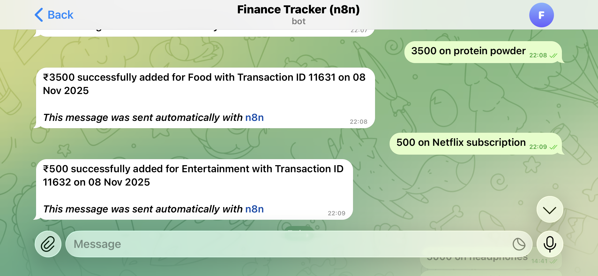
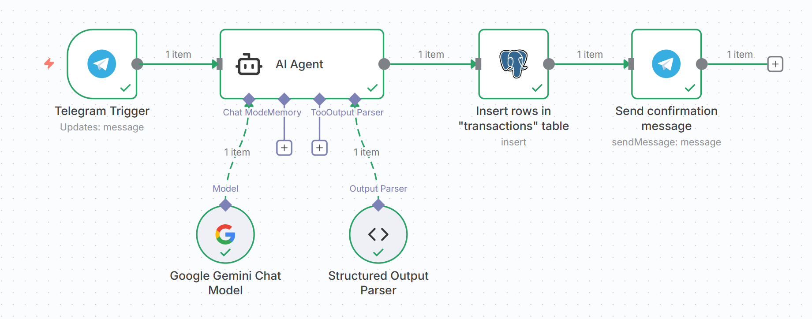
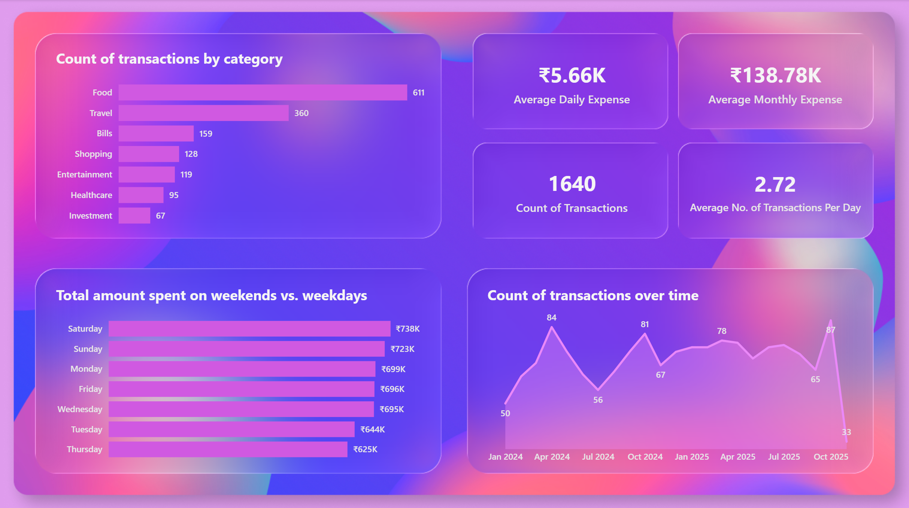

# Personal Finance Tracker - Automated Data Pipeline and Dashboard
## 🧾 Executive Summary
This project automates personal finance tracking from message-based inputs to interactive financial dashboards.  
It integrates **Telegram, n8n, AI-powered message parsing, PostgreSQL,** and **Power BI** to deliver real-time financial insights and visual analytics.  
The pipeline automatically converts unstructured expense messages into structured transactions, stores them in a database, and visualizes key spending metrics.

## 🚩 Problem
Managing personal expenses manually often leads to:
- Missing small but frequent transactions
- Difficulty identifying spending patterns
- Time-consuming data entry and report generation

The goal is to **automate data collection and transform raw transactions into clear, visual insights.**

## 🧠 Methodology
### 1️⃣ Data Collection (Telegram → n8n)  

Messages sent on Telegram are automatically parsed into structured financial entries via n8n:  

- Transaction details (e.g. “Paid ₹250 for groceries”) are sent on Telegram.
- The n8n workflow triggers automatically when a message is received.


### 2️⃣ AI Processing
A Google Gemini Chat Model node interprets each message and extracts structured fields:

- transaction_date
- transaction_type
- amount
- category
- sub_category

Output is parsed into a JSON structure using the Structured Output Parser.



### 3️⃣ Data Storage (PostgreSQL on Supabase)
- Parsed transactions are inserted into the ``transactions`` table in PostgreSQL with auto-incrementing ``transaction_id``.
- Schema:
```sql
transaction_id    INT GENERATED BY DEFAULT AS IDENTITY PRIMARY KEY,
transaction_date  DATE,
transaction_type  TEXT,
amount            INT,
category          TEXT,
sub_category      TEXT
```


- A confirmation message is sent back to Telegram once a transaction is logged.

### 4️⃣ Data Visualization (Power BI)
- Power BI connects directly to the Supabase PostgreSQL database.
- It provides interactive dashboards for:
  - Expense distribution by category
  - Spending trends over time
  - Weekday vs. weekend spending
  - Key KPIs like **average daily expense, monthly spend,** and **average transactions per day**
- 


## 🧰 Skills Demonstrated
- **Data Analytics:** Power BI (DAX, measures, visuals)
- **Data Engineering**: n8n workflow automation, Supabase (PostgreSQL)
- **Data Processing**: Prompt engineering, structured output parsing, AI-based NLP extraction
- **Data Simulation**: Python (NumPy, pandas, random distributions)
- **Database Design**: SQL schema design, identity columns, sequence management
- **ETL Automation**: No-code pipeline from Telegram → n8n → PostgreSQL → Power BI
- **Soft Skills**: Problem-solving, data storytelling, automation mindset 
