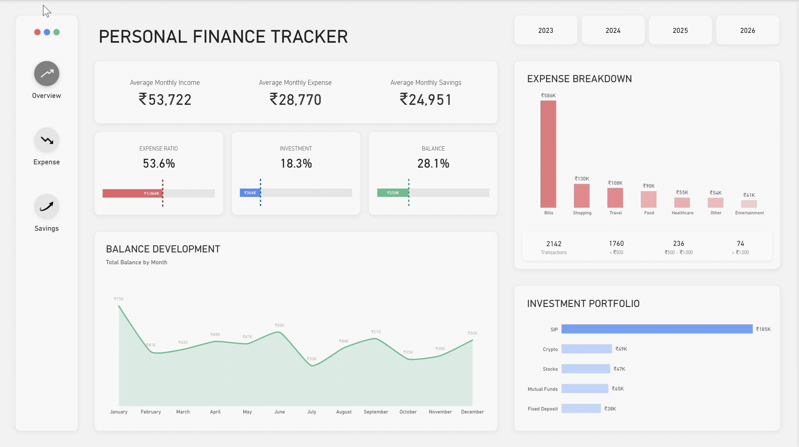
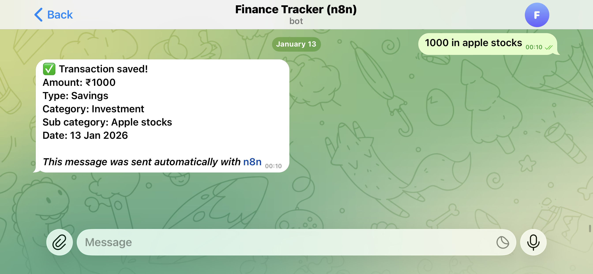
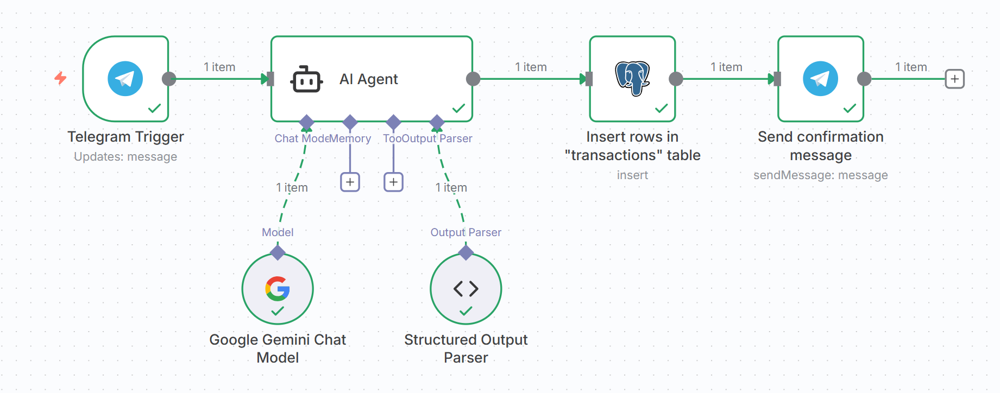
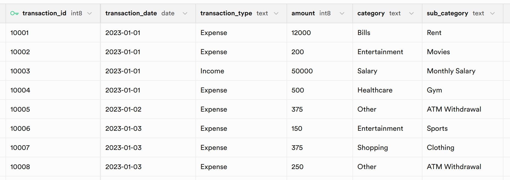
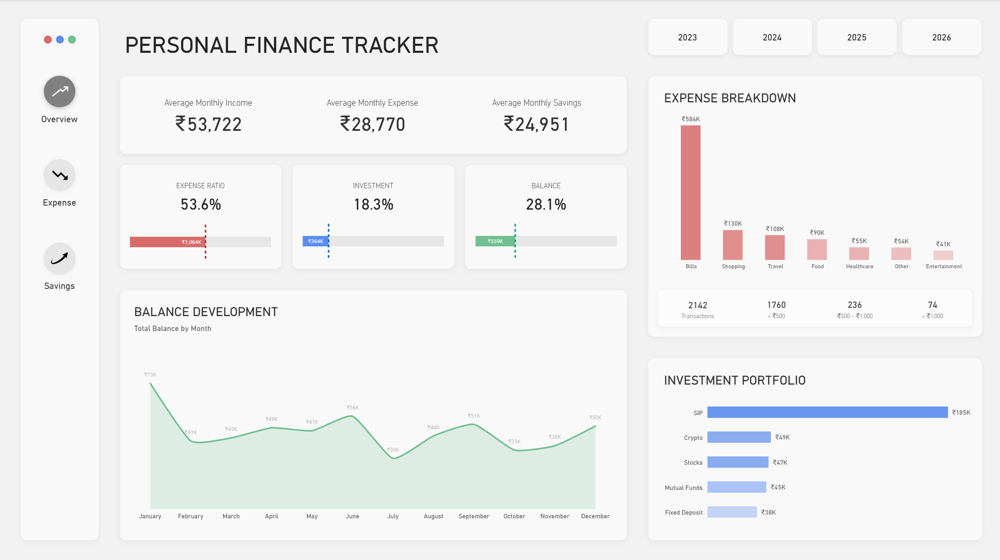
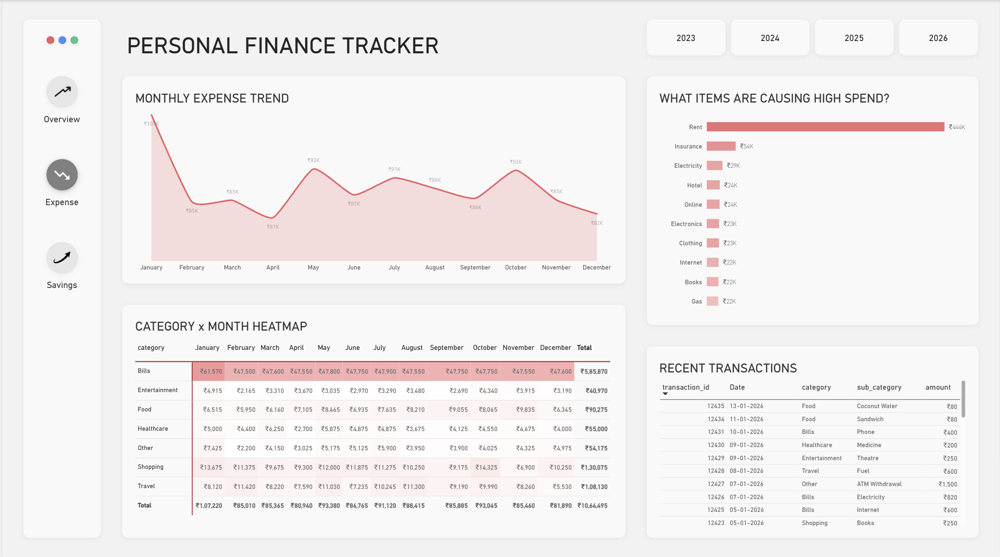
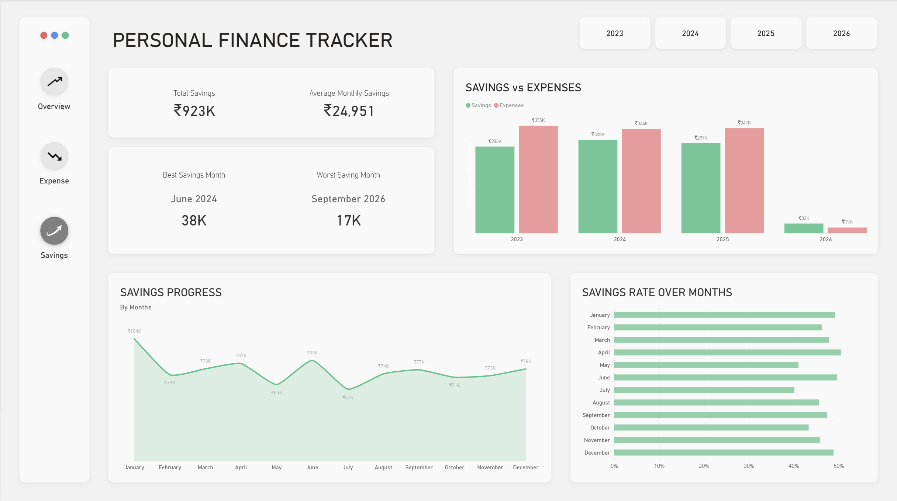

# Personal Finance Tracker - Automated Data Pipeline and Analytics Dashboard
## Project Summary
- Built an **end-to-end personal finance analytics solution** covering data collection, processing, storage, and visualization.
- **Automated** the conversion of raw transaction inputs into structured financial data.
- Designed a **3-page Power BI dashboard (Overview, Expense, Savings)** focused on clarity, insights, and recruiter-friendly storytelling.



## Problem
Managing personal expenses manually often leads to:
- Missing small but frequent transactions
- Difficulty identifying spending patterns and savings behavior
- Time-consuming data entry and report generation

**Objective:**  
Automate transaction collection and transform raw financial data into **clear, actionable insights.**

## Solution Overview
This project combines **automation + analytics** into a single workflow:
```
Transaction Input → Automated Processing → Structured Storage → Analytics Dashboard
```
The result is a system that minimizes manual effort while maximizing insight.


## Data Collection & Processing Pipeline

### 1. Data Generation (Simulation)
A custom python script ([transaction_generator.py](transaction_generator.py)) simulates 3 years of realistic financial data.  
```
python transaction_generator.py
```
This generates [transactions.csv](transactions.csv), used for dashboard development, testing, and analytics validation.  

Features:
- Random yet statistically realistic transaction amounts
- Recurring expenses (e.g., rent, bills, SIPs)
- Variable spending patterns across weekdays/weekends

### 2. Automated Data Collection
- Messages sent on Telegram are automatically parsed into structured financial entries via n8n.
- The n8n workflow triggers automatically when a message is received.

This approach removes the need for manual data entry while maintaining consistency.

### 3. Data Processing & Validation
An **AI Agent** interprets each message and extracts structured fields:

- ``transaction_date``
- ``transaction_type`` (Income / Savings / Expense)
- ``amount``
- ``category``
- ``sub_category``


Reduces errors and improves reliability of downstream analytics.

### 4. Data Storage (PostgreSQL)
- Parsed transactions are inserted into the ``transactions`` table in PostgreSQL with auto-incrementing ``transaction_id``.
- Schema:


A confirmation message is sent back to Telegram once a transaction is logged.

## Analytics & Dashboard Design
A 3-page interactive **Power BI dashboard** is connected directly to the Supabase PostgreSQL database.

### Page 1: Overview - Financial Health
**Purpose:** Identify expense drivers and potential optimization areas.

  

**Key Insight:** Savings remained consistently strong across most periods, with clear identification of peak and low-saving months.

### Page 2: Expense Analysis - Where the Money Goes
**Purpose:** High-level snapshot of overall financial performance.



**Key Insight:** Fixed expenses and lifestyle categories consistently dominate total spending, indicating areas for targeted cost control.

### Page 3: Savings Analysis - Financial Discipline
**Purpose:** Evaluate savings consistency and efficiency.



**Key Insight:** Despite expense fluctuations, savings rates remained stable, reflecting disciplined financial behavior.


## 📈 Results & Impact
- **Saved 90–95% of manual tracking time** — reduced daily expense logging from 20-30 min to under 1 min using n8n automation.
- **Achieved 100% accurate, real-time recording** of transactions through Telegram → AI → PostgreSQL pipeline.
- **Two years of complete, structured financial data** now available for continuous analytics and forecasting.
- **Identified key spending insights:**
  - Food was the **largest expense category** (~37% of transactions).
  - Weekend spending was **~15% higher** than weekdays.
  - Fixed bills and subscriptions showed **stable monthly recurrence.**
- **Improved financial awareness** — instant Telegram confirmations and Power BI visuals encouraged disciplined spending.
- **Data-driven budgeting decisions** enabled—clear visibility into expense trends, top categories, and saving potential.
- **Foundation for predictive analytics** — dataset prepared for future ML models (spending forecasts, anomaly detection, behavior clustering).


## 🧰 Skills Demonstrated
- **Data Analytics:** Power BI (DAX, measures, visuals)
- **Data Engineering**: n8n workflow automation, Supabase (PostgreSQL)
- **Data Processing**: Prompt engineering, structured output parsing, AI-based NLP extraction
- **Data Simulation**: Python (NumPy, pandas, random distributions)
- **Database Design**: SQL schema design, identity columns, sequence management
- **ETL Automation**: No-code pipeline from Telegram → n8n → PostgreSQL → Power BI
- **Soft Skills**: Problem-solving, data storytelling, automation mindset


## 🔮 Next Steps:
- **Predict Future Spending:** Build time-series models to forecast monthly expenses and income trends.
- **Category-Level Forecasting:** Use regression models to anticipate spending by category (e.g., Food, Travel, Bills).
- **Anomaly Detection:** Implement ML models (Isolation Forest) to flag irregular or unusually high expenses.
- **User Segmentation:** Apply clustering (K-Means) to identify behavior patterns like “Saver” vs “Weekend Spender.”
